# Wanderlust 🏡

A full-stack Airbnb-inspired property booking platform where users can explore listings, book stays, upload images, manage reviews, and maintain wishlists.

---

## ✨ Features

- User Authentication & Authorization
- Property Listings Management
- Booking System
- Wishlist Functionality
- Reviews & Ratings
- Cloudinary Image Upload
- Interactive Maps
- Responsive UI

---

## 🛠 Tech Stack

### Frontend
- EJS
- Bootstrap
- JavaScript

### Backend
- Node.js
- Express.js

### Database
- MongoDB Atlas

### Services & Deployment
- Cloudinary
- Render

---

## 📂 Project Structure

```bash
controllers/
models/
routes/
views/
public/
middleware/
utils/
```

---

## 🏗 Architecture

This project follows the MVC (Model-View-Controller) architecture for scalability, maintainability, and clean code organization.

---

## 🌐 Live Demo

🔗 [Live Demo](https://wanderlust-lxot.onrender.com)

---

## 👨‍💻 Author

Developed by **Hitendra Jatav**

GitHub: [Hitendrr-1](https://github.com/Hitendrr-1)

---

## 💡 Technical Highlights

- Implemented MVC Architecture
- Session-based Authentication
- RESTful Routing
- Middleware-based Authorization
- Server-side Rendering using EJS
- Cloudinary Image Management
- MongoDB Relationships
- Custom Error Handling Middleware

---

## 📸 Screenshots

### 🏠 Home Page
<p align="center">
  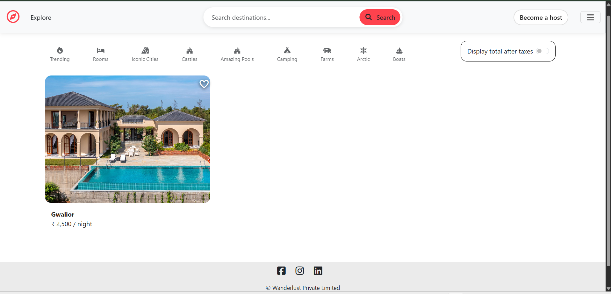
</p>

---

### 🏡 Host Home Page
<p align="center">
  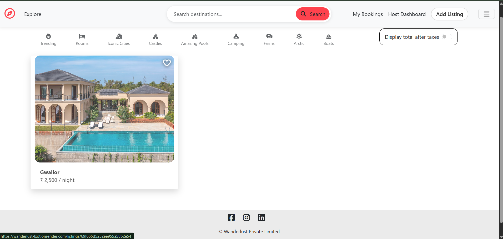
</p>

---

### 📋 Listing Page
<p align="center">
  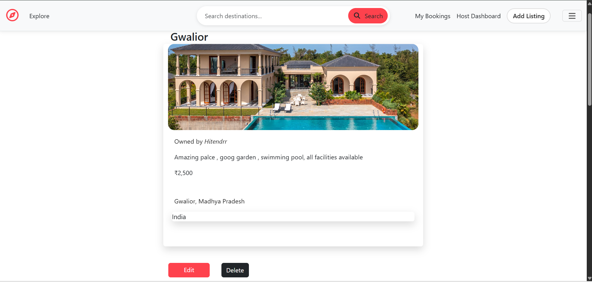
</p>

---

### ⭐ Leave Review Page
<p align="center">
  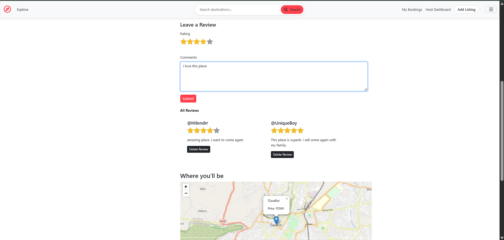
</p>

---

### 🗺️ Listing Map
<p align="center">
  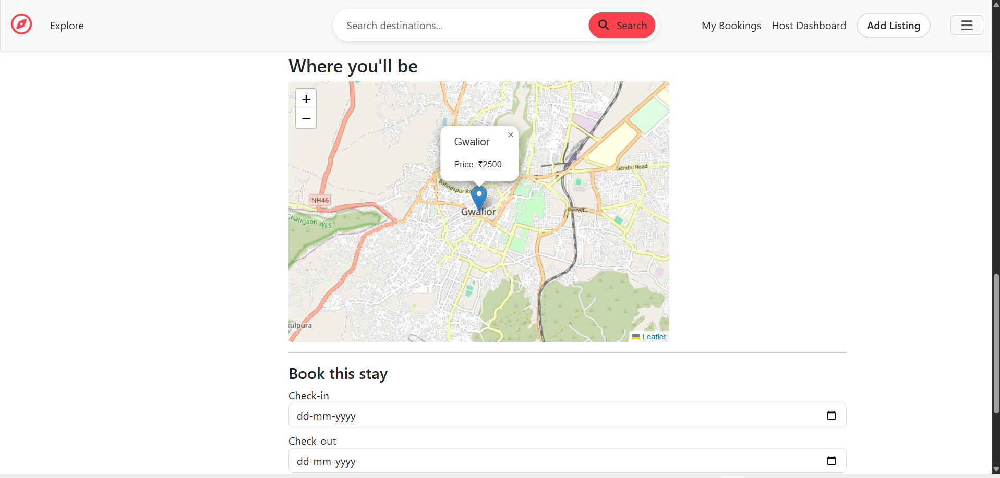
</p>

---

### 📅 Booking System
<p align="center">
  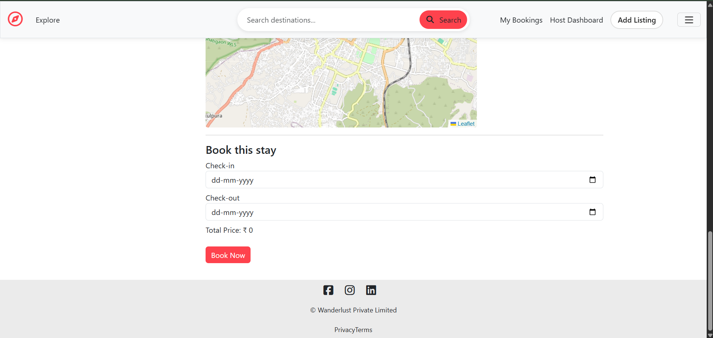
</p>

---

### 🔐 Signup Form
<p align="center">
  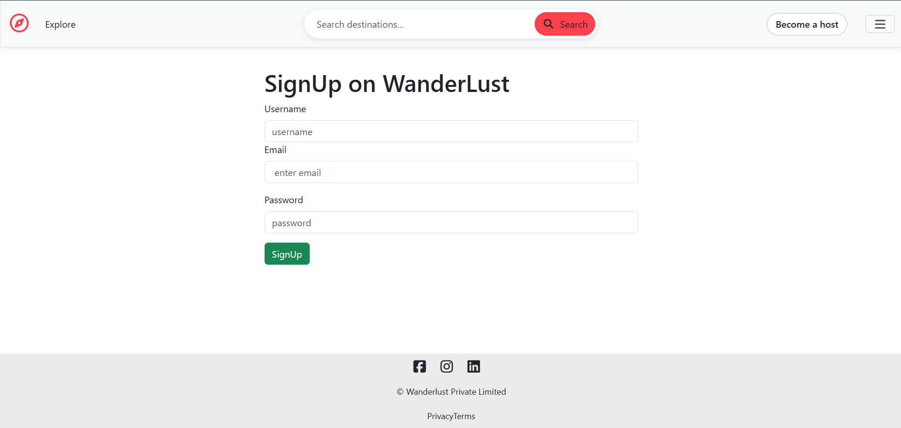
</p>

---

### 🔑 Login Form
<p align="center">
  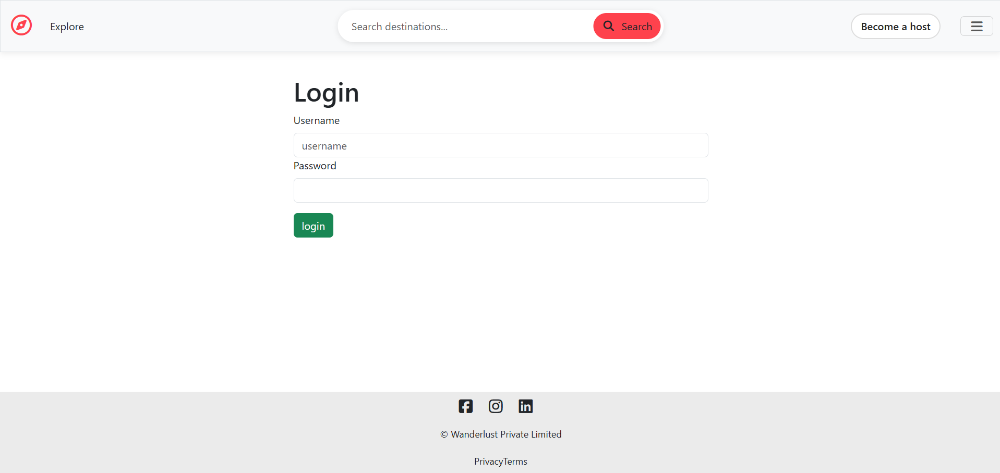
</p>

---

### 📖 User Booking Page
<p align="center">
  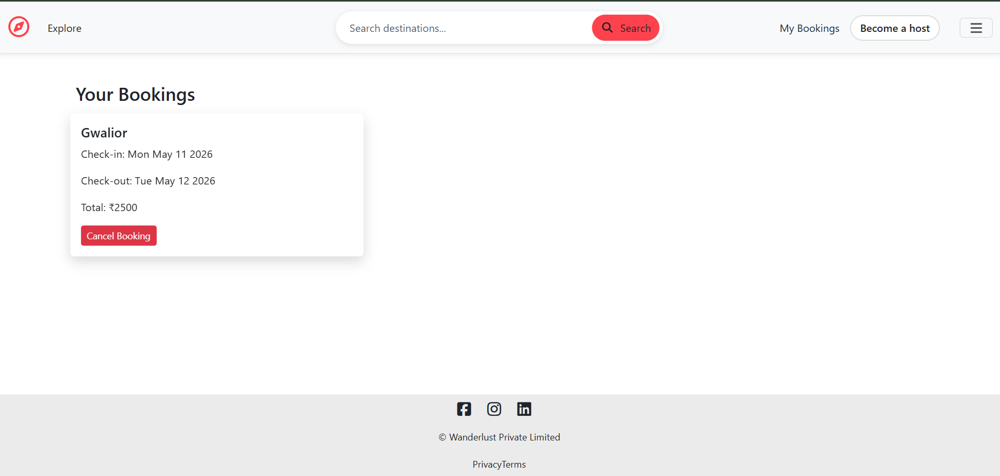
</p>

---

### ❤️ Wishlist Page
<p align="center">
  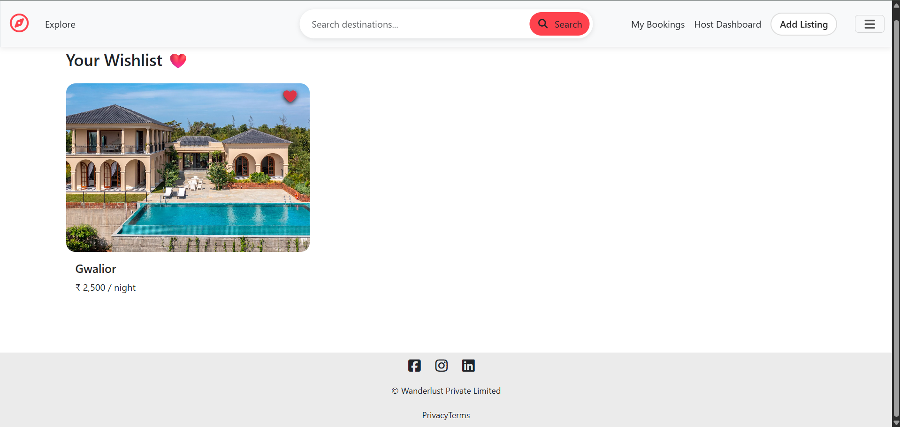
</p>

---

### ✏️ Edit Listing Page
<p align="center">
  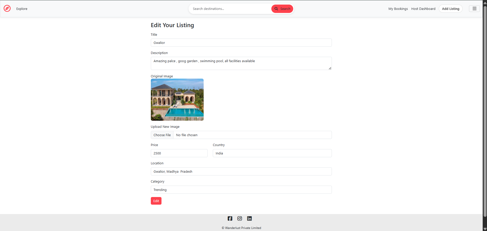
</p>

---

### 👤 Host Profile
<p align="center">
  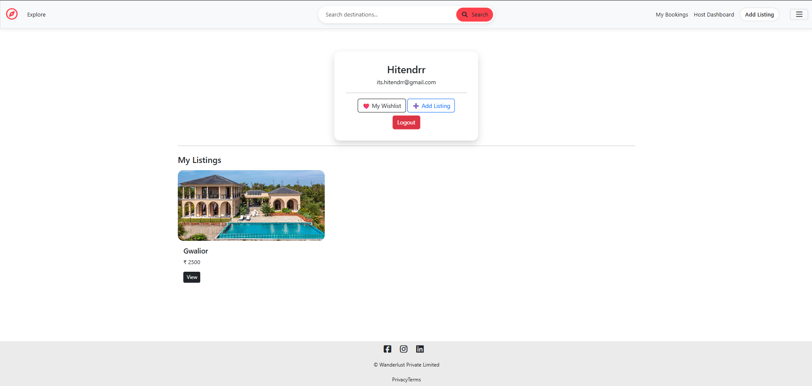
</p>

---

### ☰ Navigation Menu
<p align="center">
  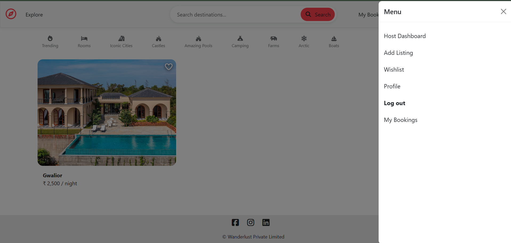
</p>

---

### 📱 Mobile Responsive UI 1
<p align="center">
  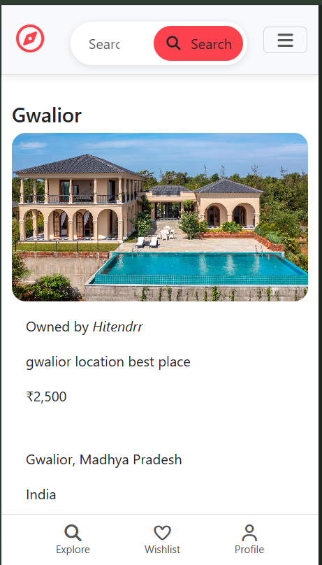
</p>

---

### 📱 Mobile Responsive UI 2
<p align="center">
  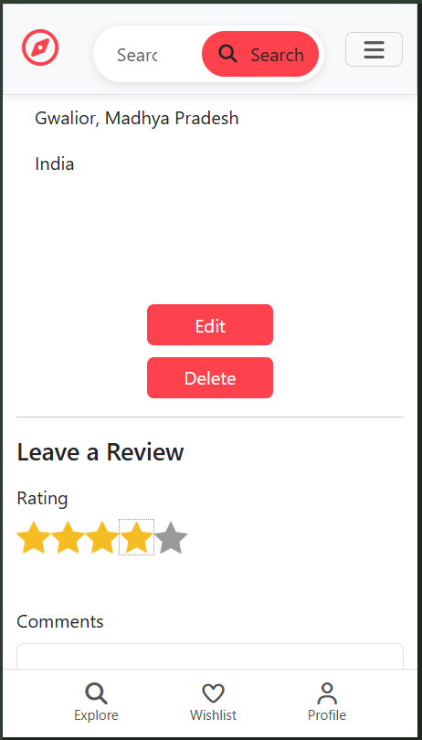
</p>

---

### 📱 Mobile Responsive UI 3
<p align="center">
  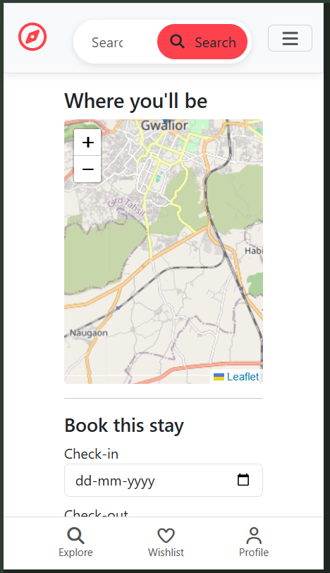
</p>

---

### 📱 Mobile Responsive UI 4
<p align="center">
  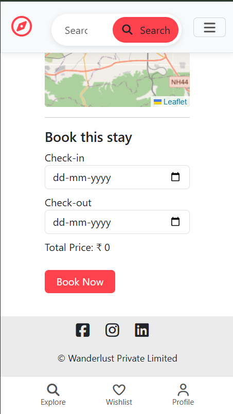
</p>

---

## Environment Variables

```env
CLOUD_NAME=your_cloudinary_name

CLOUD_API_KEY=your_cloudinary_api_key

CLOUD_API_SECRET=your_cloudinary_api_secret

ATLASDB_URL=your_mongodb_connection_string

SECRET=your_session_secret
```


---

## 🌐 Deployment

- Frontend & Backend deployed on Render
- Database hosted on MongoDB Atlas
- Image storage managed using Cloudinary

---

##  What I Learned

- MVC Architecture
- Authentication & Authorization
- RESTful APIs
- Backend Routing
- Middleware Handling
- Cloudinary Integration
- MongoDB Relationships
- Session Management
- Deployment Workflow
- Error Handling  

---

##  Future Improvements

- Payment Gateway Integration
- Real-time Chat System

---

## ⚡ Installation

Clone the repository:

```bash
git clone https://github.com/Hitendrr-1/Wanderlust.git
```

Install dependencies:

```bash
npm install
```

Start the development server:

```bash
npm start
```